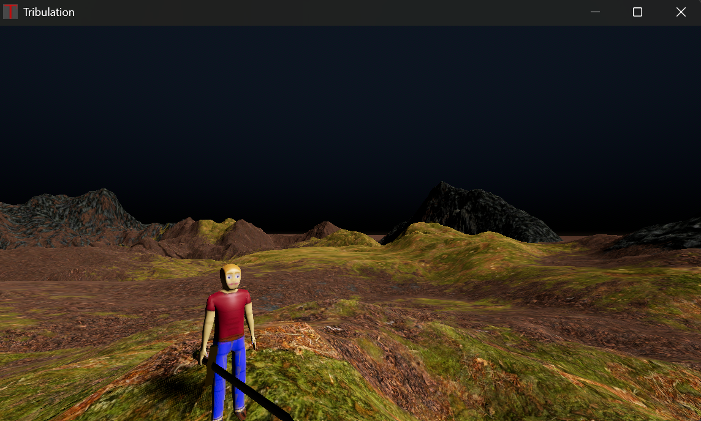

An attempt at another full fledged game in Godot. In this one I believe I had gotten the steam api to work as a multiplayer peer. That meant that I could connect two players together using the "join game", "join lobby", and similar functions through the friends list on steam. The game here uses some plugin to generate a map. The players were fully animated, had exchangable weapons, and could perform the dab dance. 

